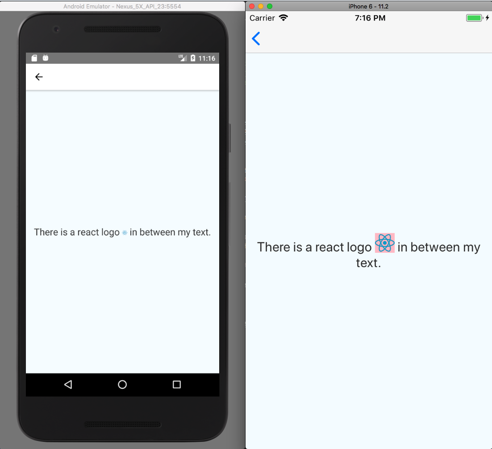
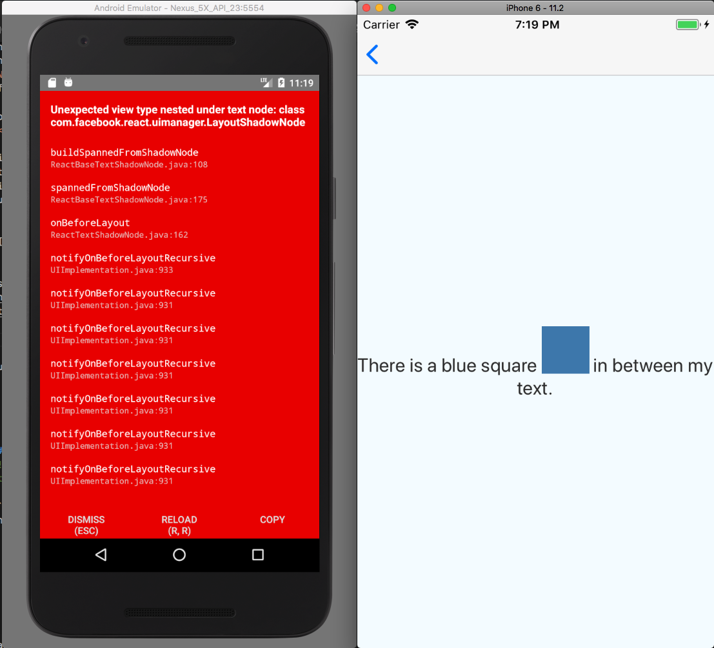
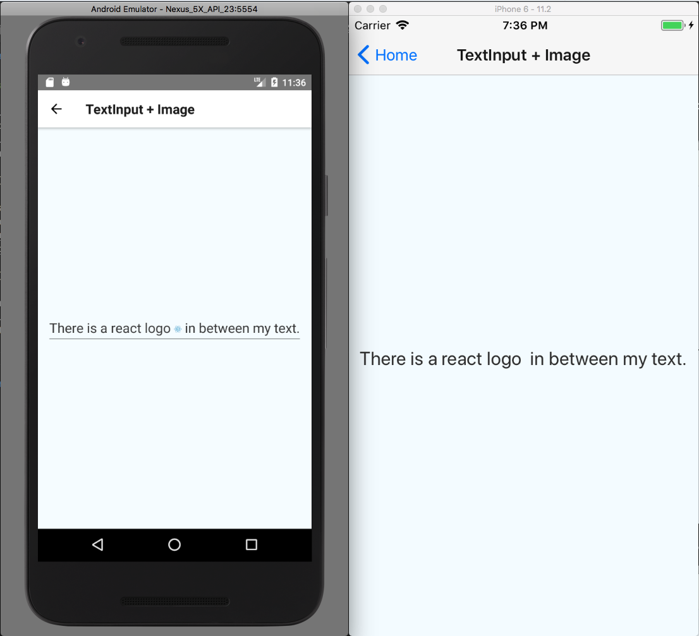
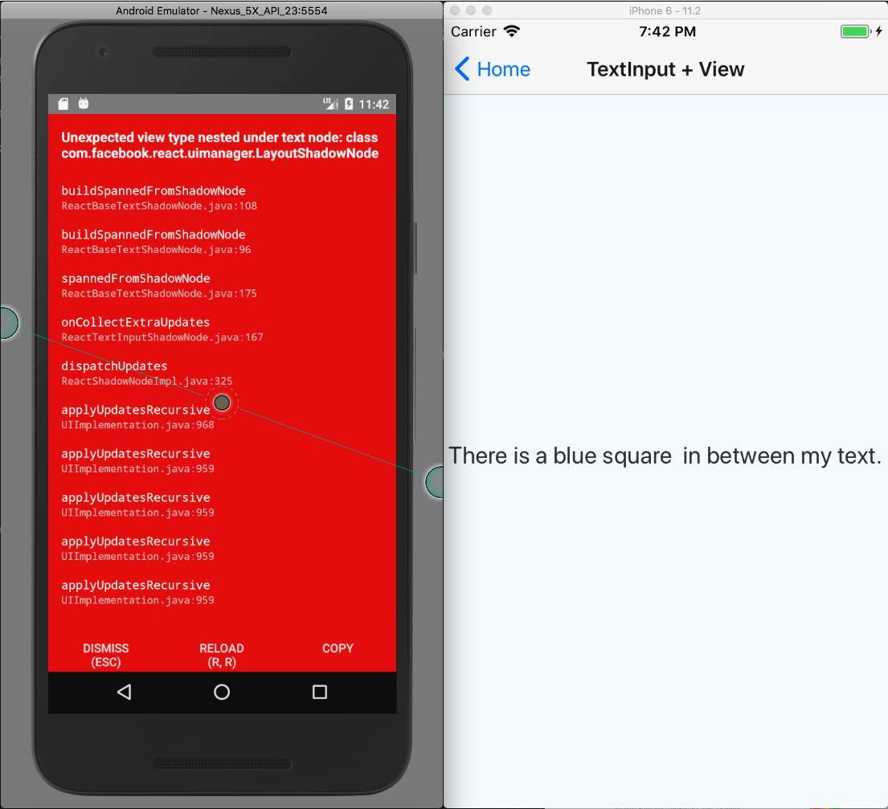

# ReactNativeBug-NestedViewInTextInput

<!--
  We use GitHub Issues exclusively for tracking bugs in React Native.
  Questions? Visit http://facebook.github.io/react-native/help.html
  If this issue is about documentation or the website, please file it at:
  https://github.com/facebook/react-native-website/issues/new
-->

- [x] I have reviewed the [documentation](https://facebook.github.io/react-native)
- [x] I have searched [existing issues](https://github.com/facebook/react-native/issues)
- [x] I am using the [latest React Native version](https://github.com/facebook/react-native/releases)

<!-- Describe your issue in detail. -->

There were a few similar issues before this one that got closed by the bot ([facebook/react-native#17467](https://github.com/facebook/react-native/issues/17467) & [facebook/react-native#17468](https://github.com/facebook/react-native/issues/17468)) because it's missing information or went stale. The author open a [stack overflow question](https://stackoverflow.com/questions/48033885/how-to-insert-custom-emoji-small-pictures-into-textinput-of-react-native) that did not get answer.

Here's my attempt to provide a more complete argument and be as informative as possible to help push this feature request/bug fix forward.

I'm aware that `<TextInput />` uses `SpannableString` in Android and `NSAttributedString` in iOS underneath, both are capable of inlining image (Android with `ImageSpan` and iOS with `NSTextAttachment`). But this is not supported by React Native as of `v0.54.2`.

To be specific, I'm talking about `<Image />` nested within `<Text />` nested within `<TextInput multiline />`.

## Environment

<!-- Required. Run `react-native info` in your terminal and paste its contents here. -->

```
Environment:
  OS: macOS High Sierra 10.13.3
  Node: 9.2.0
  Yarn: 1.3.2
  npm: 5.5.1
  Watchman: 4.9.0
  Xcode: Xcode 9.2 Build version 9C40b
  Android Studio: 3.0 AI-171.4443003

Packages: (wanted => installed)
  react: ^16.3.0-alpha.1 => 16.3.0-alpha.3
  react-native: 0.54.2 => 0.54.2
```

## Steps to Reproduce

<!-- 
  Required. Let us know how to reproduce the issue. Include a code sample, share a project, 
  or share an app that reproduces the issue using [Snack](https://snack.expo.io/).
-->

A react native project have been created at [lxcid/ReactNativeBug-NestedViewInTextInput](https://github.com/lxcid/ReactNativeBug-NestedViewInTextInput). You can pull it down locally and launch the project with `react-native run-ios` or `react-native run-android`.

## Expected Behavior

<!-- Write what you thought would happen. -->

At minimum, I would hope for `<TextInput>` + `<Text>` + `<Image>` to work as expected in iOS and Android.

https://github.com/lxcid/ReactNativeBug-NestedViewInTextInput/blob/1afdd2383ac70d08edc7c4742321cc46c5af225b/app/screens/TextInputImageScreen.js#L14-L23

## Actual Behavior

<!-- Write what happened. Include screenshots if needed. If this is a regression, let us know. -->

### Text + Image

First of all, `<Text />` do support nested images, even though its not well documented. There might be some rendering differences between iOS and Android, but they are generally supported.



### Text + View

As for nested views in `<Text />`, only iOS is supported. This is documented [here](https://facebook.github.io/react-native/docs/text.html#nested-views-ios-only).



### TextInput + Image

Surprisingly, for `<Image />` nested within `<Text />` nested within `<TextInput />`, It worked for Android but not so much for iOS, which did not display the image.



### TextInput + View

As for nested views in `<TextInput />`, Android crashes while iOS does not display the image.



### Summary

I create a table to summarize and compare what we have observed here:

|              Components              | Android | iOS |
| :----------------------------------: | :-----: | :-: |
|         `<Text>` + `<Image>`         |   ✅    | ✅  |
|         `<Text>` + `<View>`          |   💥    | ✅  |
| `<TextInput>` + `<Text>` + `<Image>` |   ✅    | ❌  |
|  `<TextInput>` +`<Text>` + `<View>`  |   💥    | ❌  |

## References
